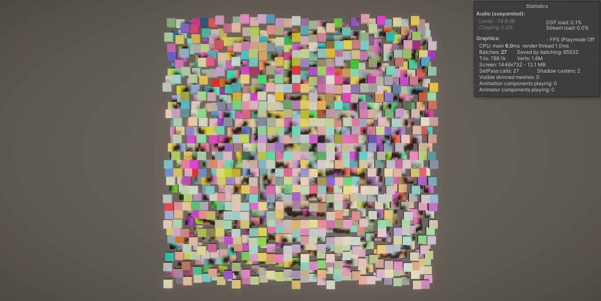
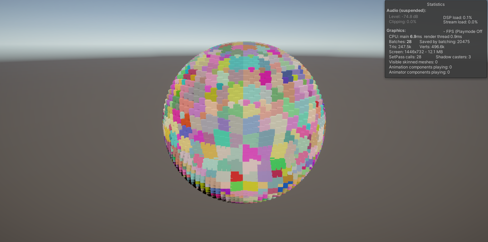
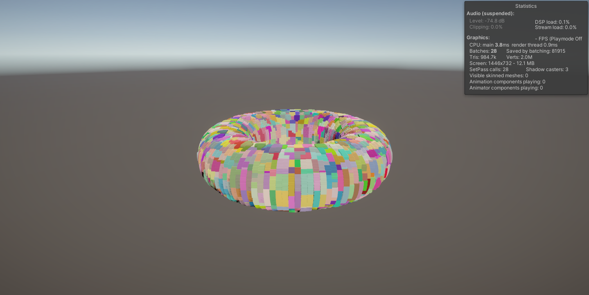

# Catlike Coding - Unity Pseudorandom Noise Tutorial

Unity Version: `2022.3.16f1`

This repository will contain the complete Unity project for the [Pseudorandom Noise](https://catlikecoding.com/unity/tutorials/pseudorandom-noise/value-noise/) tutorial.

## Contents

### GPU Instancing and Hashing

Using a mesh and material, we render a grid of cubes. We use a shader to color the cubes based on their position in the grid. We use a hash function to generate a random color for each cube. We can then apply displacement to the cubes to create some variation in the grid.

The shapes that can be rendered with GPU instancing are limited to Planes, Spheres, and Toruses at the time of writing. 

The most efficient mesh to use to render any of these shapes is a cube. Any other mesh will require more vertices and therefore more memory.

#### Images

##### Plane

##### Sphere

##### Torus

### Value Noise (Lattice Noise 1D / 2D)

We use the same instanced cube grid as above, but instead of using a hash function to generate a random color, we use a value noise function. We can then use the value noise function to generate a height map for the cubes. We can then use the height map to displace the cubes in the grid.

We use a grayscale color gradient to color the cubes based on their height. If the height is below a certain threshold, we color the cube red. If the height is above a certain threshold, we color the cube white. We can then use the height map to displace the cubes in the grid to create something that begins to resemble a landscape.

Currently the value noise function is only implemented for 1D and 2D (Bilinear Interpolation). The smooth noise and 3D implementation are what I plan to implement next.

The Lattice Noise function works for the following shapes: Plane, Sphere, and Torus

Any mesh can be used to render these shapes, but the most efficient mesh to use is a cube.

